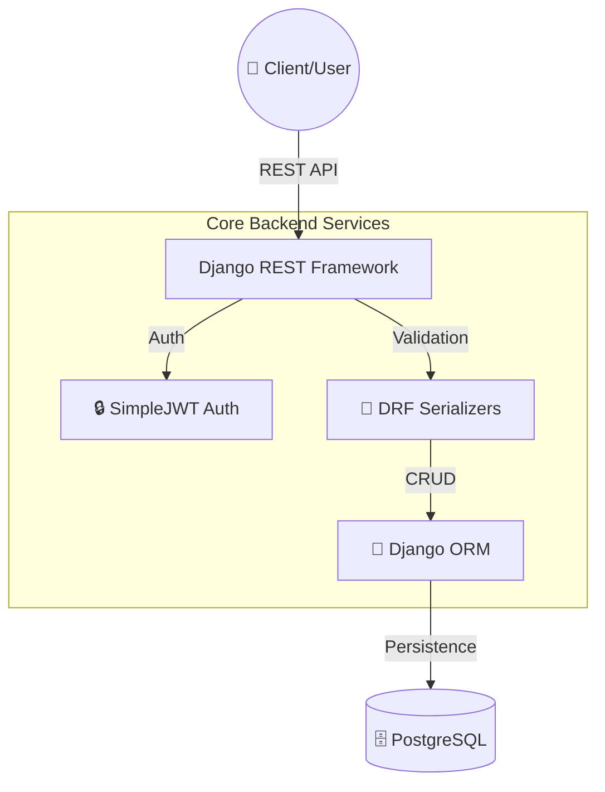
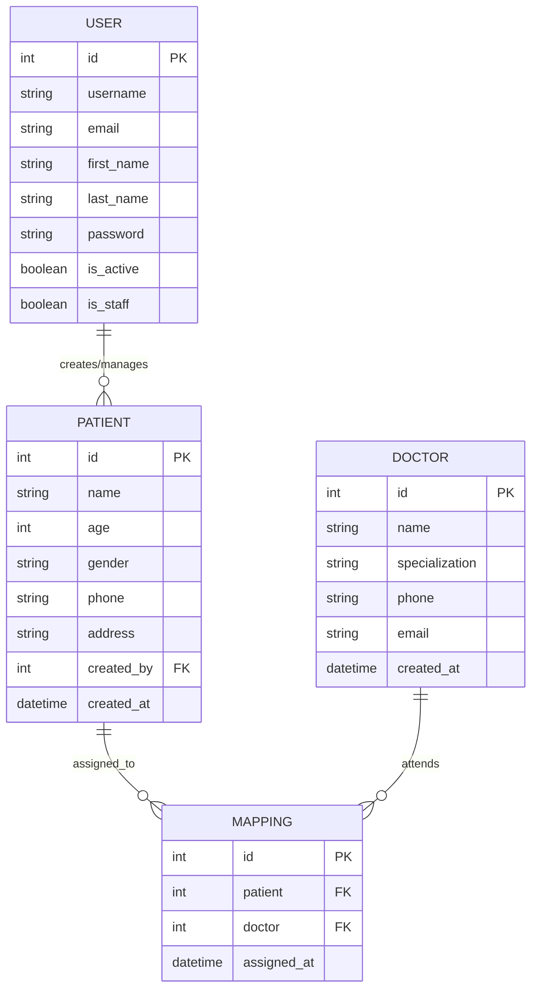
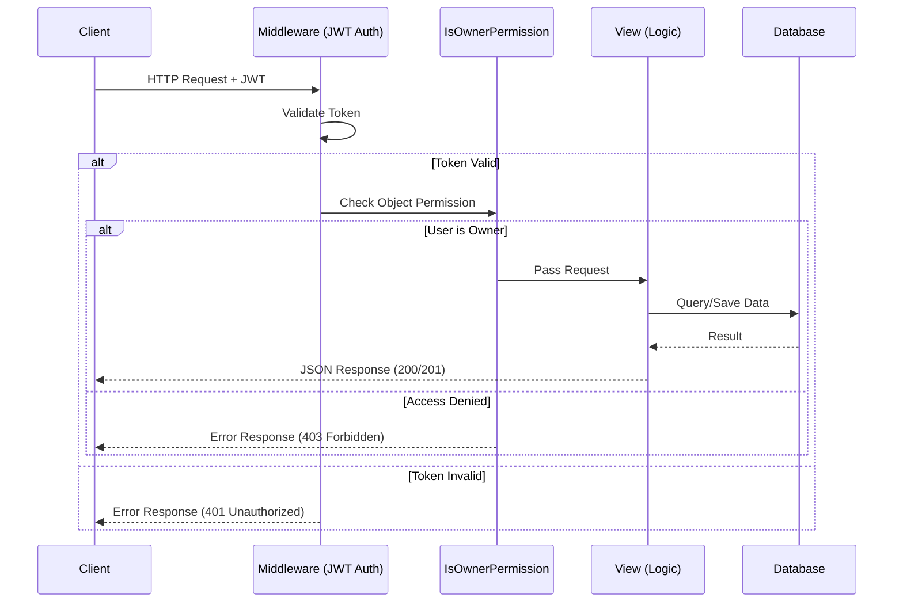

# 🏥 Healthcare Backend API

A robust and secure REST API designed for hospital staff, patient management, and doctor-patient relationship tracking.

---

## 🏗️ System Architecture



## Tech Stack
- Django >=4.2,<5.0
- Django REST Framework >=3.14
- djangorestframework-simplejwt >=5.3
- PostgreSQL (via psycopg2-binary)
- python-dotenv >=1.0

## Project Structure
```
healthcare_backend/
├── authentication/
│   ├── serializers.py
│   ├── urls.py
│   ├── views.py
├── core/
│   ├── exceptions.py
│   ├── permissions.py
├── doctors/
│   ├── migrations/
│   ├── models.py
│   ├── serializers.py
│   ├── urls.py
│   ├── views.py
├── healthcare_backend/
│   ├── settings.py
│   ├── urls.py
│   ├── wsgi.py
├── mappings/
│   ├── migrations/
│   ├── models.py
│   ├── serializers.py
│   ├── urls.py
│   ├── views.py
├── patients/
│   ├── migrations/
│   ├── models.py
│   ├── serializers.py
│   ├── urls.py
│   ├── views.py
├── .env
├── .env.example
├── manage.py
├── requirements.txt
└── Postman_Collection.json
```

---

## 📊 Database Schema



## Getting Started

### 1. Clone the repo
```bash
git clone <your-repo-url>
cd healthcare_backend
```

### 2. Create virtual environment
```bash
python -m venv venv
venv\Scripts\activate         # Windows
# source venv/bin/activate    # Mac/Linux
```

### 3. Install dependencies
```bash
pip install -r requirements.txt
```

### 4. Set up environment variables
Create a `.env` file in the root directory (tip: copy `.env.example`):
```text
SECRET_KEY=your_secret_key_here
DEBUG=True
DB_NAME=healthcare_db
DB_USER=postgres
DB_PASSWORD=your_password
DB_HOST=localhost
DB_PORT=5432
```

### 5. Run migrations
```bash
python manage.py makemigrations
python manage.py migrate
```

### 6. Start the server
```bash
python manage.py runserver
```

## API Endpoints

### Auth
| Method | Endpoint | Description | Auth Required |
|--------|----------|-------------|---------------|
| POST | /api/auth/register/ | Register new user | No |
| POST | /api/auth/login/ | Login, returns JWT tokens | No |

### Patients
| Method | Endpoint | Description | Auth Required |
|--------|----------|-------------|---------------|
| POST | /api/patients/ | Create new patient | Yes |
| GET | /api/patients/ | List user's patients | Yes |
| GET | /api/patients/{id}/ | Get patient details | Yes |
| PUT | /api/patients/{id}/ | Update patient | Yes |
| DELETE | /api/patients/{id}/ | Delete patient | Yes |

### Doctors
| Method | Endpoint | Description | Auth Required |
|--------|----------|-------------|---------------|
| POST | /api/doctors/ | Create new doctor | Yes |
| GET | /api/doctors/ | List all doctors | Yes |
| GET | /api/doctors/{id}/ | Get doctor details | Yes |
| PUT | /api/doctors/{id}/ | Update doctor | Yes |
| DELETE | /api/doctors/{id}/ | Delete doctor | Yes |

### Patient-Doctor Mappings
| Method | Endpoint | Description | Auth Required |
|--------|----------|-------------|---------------|
| POST | /api/mappings/ | Assign doctor to patient | Yes |
| GET | /api/mappings/ | List all mappings | Yes |
| GET | /api/mappings/{patient_id}/ | Get doctors for a patient | Yes |
| DELETE | /api/mappings/delete/{id}/ | Remove doctor assignment | Yes |

## Authentication

This project uses JWT (JSON Web Token) for stateless authentication. After logging in, include the access token in your request headers:

```
Authorization: Bearer <your_access_token>
```

### Token Details
- **Access Token Lifetime**: 60 minutes
- **Refresh Token Lifetime**: 1 day
- **Token Type**: Bearer

---

### 🔄 Request Lifecycle



---

## 🧪 Testing

The project includes a robust testing suite with tests for all modules.

### Run all tests
```bash
python manage.py test
```

### Run tests for specific module
```bash
python manage.py test authentication
python manage.py test patients
python manage.py test doctors
python manage.py test mappings
```

---

## 🛡️ Security Features

### Patient Ownership
- Patients are scoped to the user who created them via `created_by` foreign key
- Users can only view, edit, and delete their own patients

### Custom Permission
- `IsOwnerPermission`: Ensures users can only access resources they own
- Applied to patient detail endpoints for privacy protection

### Mapping Security
- Users can only map their own patients to doctors
- Duplicate assignments prevented by database-level unique constraint

### Error Handling
- Custom exception handler returns consistent error format: `{"error": "message"}`
- No sensitive data exposed in error responses

## 📋 Postman Collection

A complete Postman collection is included in `Postman_Collection.json` with all endpoints pre-configured. Import this file into Postman to test the API interactively.

## Notes

- Uses Django's built-in User model with standard fields (username, email, first_name, last_name)
- Patient records include: name, age, gender (Male/Female/Other), phone, address
- Doctor records include: name, specialization, phone, email (unique)
- Mappings use a bridge table with unique constraint on (patient, doctor) combination
- Gender choices restricted to: Male, Female, Other
- Phone numbers limited to 15 characters
- Addresses stored up to 255 characters
- All timestamps automatically managed by Django

---

**Built with ❤️ for healthcare professionals**
